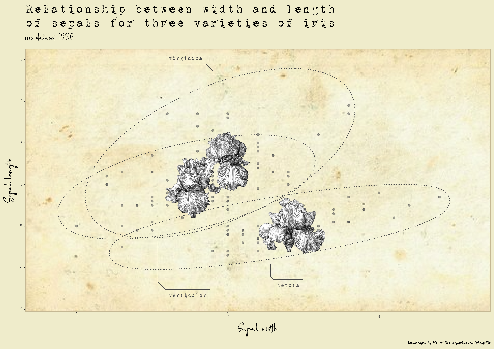

<!-- README.md is generated from README.Rmd. Please edit that file -->

```{r, include = FALSE}
knitr::opts_chunk$set(
  collapse = TRUE,
  comment = "#>"
)
```

# plotellaneous 🎨📊

<!-- badges: start -->
<!-- badges: end -->

I put in `plotellaneous` my miscellaneous dataviz experiments 🖋🖍

Plots are produced with R. I mainly use the `{ggplot2}` package and the packages that revolve around it. 

```{r echo=FALSE, out.width="50%", fig.align='center'}
knitr::include_graphics("plots/margotbr_plot_sepal_wl.gif")
```

### Squirrels location in Central Park, NYC 🐿️

```{r echo=FALSE, out.width="891px", out.height="891px"}
knitr::include_graphics("plots/margotbr_squirrels_nyc.png")
```

### Vintage `iris` dataviz 🌸

```{r echo=FALSE, out.width="891px", out.height="630px"}

```
