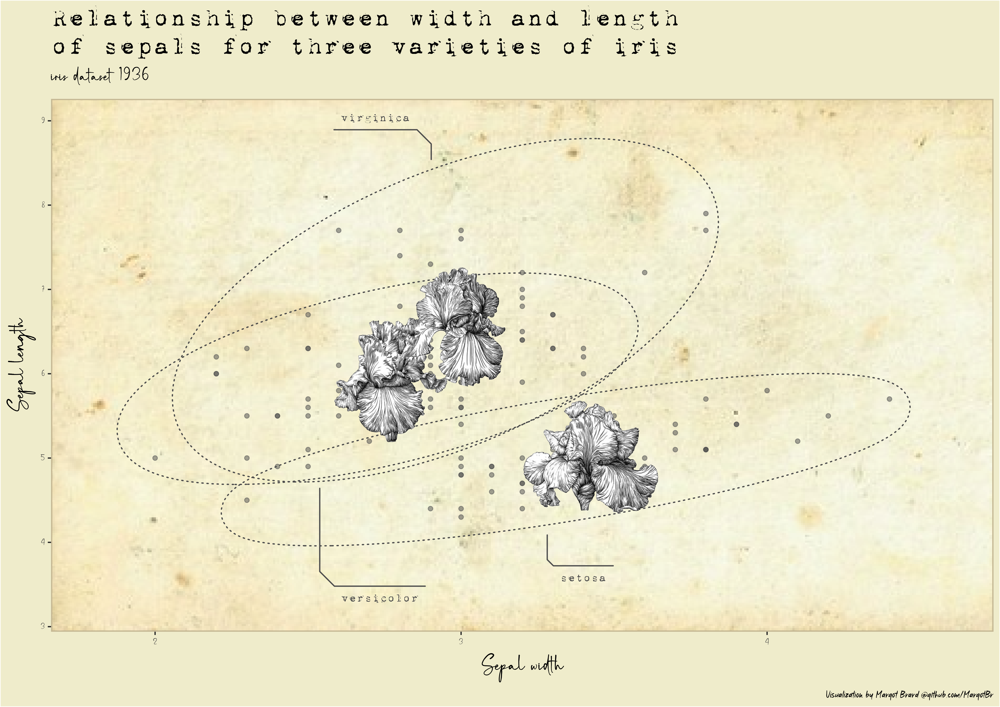

<!-- README.md is generated from README.Rmd. Please edit that file -->

# plotellaneous 🎨📊

<!-- badges: start -->
<!-- badges: end -->

I put in `plotellaneous` my miscellaneous dataviz experiments 🖋🖍

Plots are produced with R. I mainly use the `{ggplot2}` package and the
packages that revolve around it (`{ggforce}`, `{cowplot}`, `{ggpubr}`,
etc.).

### Squirrels location in Central Park, NYC 🐿️

### Vintage `iris` dataviz 🌸

