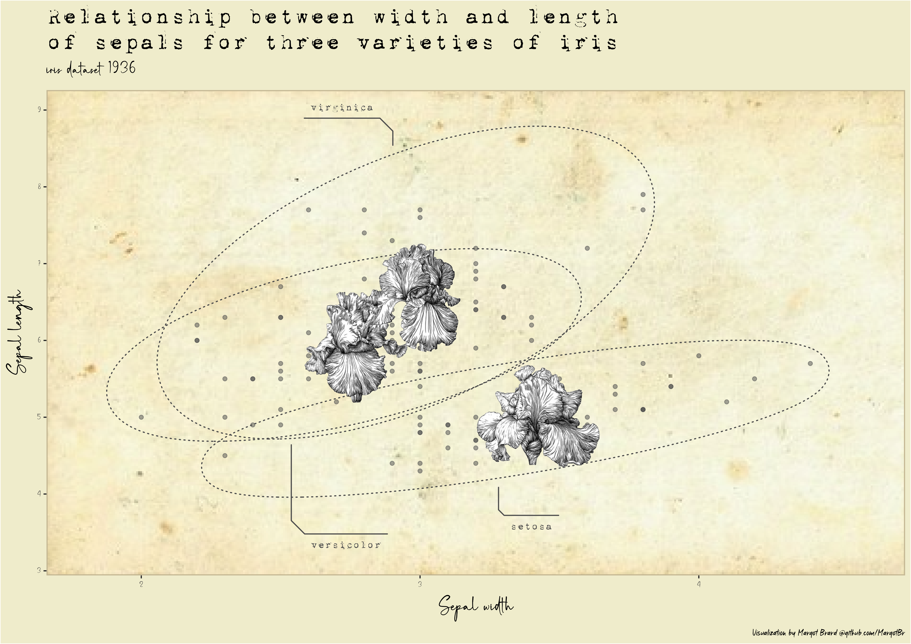

```{r setup, include=FALSE}
knitr::opts_chunk$set(echo = FALSE)
knitr::opts_chunk$set(message = FALSE)
knitr::opts_chunk$set(warning = FALSE)
```

```{r}
library(ggplot2)
library(magrittr)
library(dplyr)
library(ggforce)
library(ggpubr)
library(cowplot)
```

This vignette presents the code to produce 3 vintage data visualizations built from the `iris` dataset (1936): 

- Relationship between width and length of sepals for three varieties of iris
- Number of observations of each of the three varieties in the dataset
- Relationship between length of sepals and length of petals

```{r}
# Required fonts : 1942 report, Chorettan, Marker Mark
# extrafont::font_import()
```

### Relationship between width and length of sepals for three varieties of iris

```{r echo=TRUE, out.width="891px", out.height="630px", results='hide'}
# Build the basic plot with background image
plot_sepal_wl <- iris %>% 
  ggplot() +
  background_image(png::readPNG("images/vintage_paper.png")) + 
  aes(x = Sepal.Width, y = Sepal.Length) +
  geom_point(alpha = 0.5, color = "#5E5E5E")

# Add ellipses
plot_sepal_wl <- plot_sepal_wl + 
  geom_mark_ellipse(aes(group = Species, label = Species), 
                    linetype = 3, 
                    color = "#5E5E5E", 
                    label.family = "1942 report",
                    label.colour = "#5E5E5E", 
                    label.fontsize = 10,
                    label.fill = NA, 
                    con.linetype = 1, 
                    con.colour = "#5E5E5E")
  
# Find the centroids of the ellipses & add iris images
data_centroid_ellipses_images <- ggplot_build(plot_sepal_wl)$data[[3]] %>% 
  as_tibble() %>%
  select(x, y, group) %>% 
  mutate(Species = case_when(
    group == 1 ~ levels(iris$Species)[1],
    group == 2 ~ levels(iris$Species)[2],
    group == 3 ~ levels(iris$Species)[3]
  )) %>% 
  group_by(Species) %>% 
  summarise(centroid_x = mean(x), 
            centroid_y = mean(y),
            .groups = "drop") %>% 
  left_join(
    tibble::tibble(
      Species = iris %>% distinct(Species) %>% pull(),
      image = c("images/iris_1.png", "images/iris_2.png", "images/iris_3.png")
      ),
    by = "Species")

# Add iris images in ellipses
plot_sepal_wl <- plot_sepal_wl +
  draw_image(image = data_centroid_ellipses_images %>% slice(1) %>% select(image) %>% pull(), 
             x = data_centroid_ellipses_images %>% slice(1) %>% select(centroid_x) %>% pull(), 
             y = data_centroid_ellipses_images %>% slice(1) %>% select(centroid_y) %>% pull(), 
             hjust = 0.5, vjust = 0.5, scale = 1.5) +
  draw_image(image = data_centroid_ellipses_images %>% slice(2) %>% select(image) %>% pull(), 
             x = data_centroid_ellipses_images %>% slice(2) %>% select(centroid_x) %>% pull(), 
             y = data_centroid_ellipses_images %>% slice(2) %>% select(centroid_y) %>% pull(), 
             hjust = 0.5, vjust = 0.5, scale = 1.5) +
  draw_image(image = data_centroid_ellipses_images %>% slice(3) %>% select(image) %>% pull(), 
             x = data_centroid_ellipses_images %>% slice(3) %>% select(centroid_x) %>% pull(), 
             y = data_centroid_ellipses_images %>% slice(3) %>% select(centroid_y) %>% pull(), 
             hjust = 0.5, vjust = 0.5, scale = 1.5) 

# Increase the limits
plot_sepal_wl <- plot_sepal_wl +
  scale_x_continuous(expand = c(0.1, 0.1)) +
  scale_y_continuous(expand = c(0.1, 1))

# Change titles
plot_sepal_wl <- plot_sepal_wl +
  labs(title = "Relationship between width and length\nof sepals for three varieties of iris",
       subtitle = "iris dataset 1936",
       x = "Sepal width", 
       y = "Sepal length", 
       caption = "Visualization by Margot Brard @github.com/MargotBr")

# Change theme
plot_sepal_wl <- plot_sepal_wl +
  theme(
    plot.title = element_text(family = "1942 report", size = 22),
    plot.subtitle = element_text(family = "Chorettan", size = 22),
    axis.title = element_text(family = "Chorettan", size = 25),
    axis.text = element_text(family = "Chorettan", size = 10),
    plot.background = element_rect(fill = "#F2EFD5"),
    panel.border = element_rect(fill = NA, color = "#D0C4A5", size = 1),
    plot.caption = element_text(family = "Marker Mark")
  )

# Save plot as PDF and PNG 
ggsave(filename = "plots/margotbrd_plot_sepal_wl.pdf", 
       plot = plot_sepal_wl, 
       device = cairo_pdf, 
       width = 297, 
       height = 210, 
       units = "mm")

png(filename = "plots/margotbrd_plot_sepal_wl.png",
    width = 297, 
    height = 210, 
    units = "mm",
    res = 400)
print(plot_sepal_wl)
dev.off()
```

```{r out.width="891px", out.height="630px"}

```

### Number of observations of each of the three varieties in the dataset

```{r}
iris %>% 
  count(Species) %>% 
  ggplot() +
  aes(x = Species, y = n) +
  geom_col()
```

### Relationship between length of sepals and length of petals

```{r}
iris %>% 
  group_by(Sepal.Length) %>% 
  summarise(Petal.Length = mean(Petal.Length)) %>% 
  ggplot() +
  aes(x = Sepal.Length, y = Petal.Length) +
  geom_line()
```
